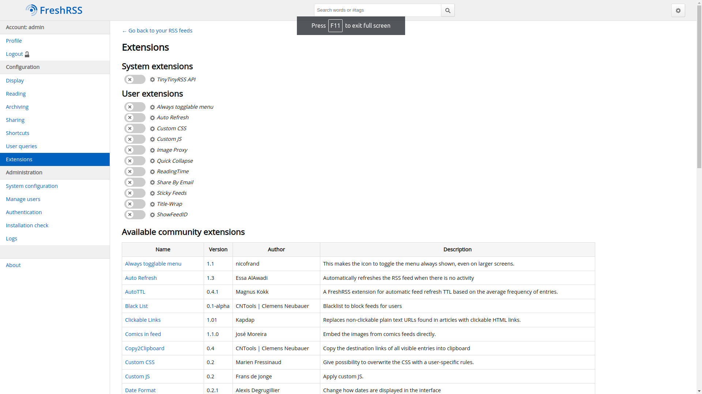

# Docker setup for Full text Freshrss



This is my docker setup that I using in my home server. It includes:

- Freshrss with postgres database with minimal configuration needed
- Full text RSS for extracting articles without having to visit the website
- Extension configuration on `Freshrss.Dockerfile` image file

## Instalation

1. (Optional) Create a `.env` file and configure the settings like in the `example.env`

```bash
$ touch .env
```

2. Run compose

```bash
$ docker compose up -d
```

## Why?

Better browsing the web

Recommend this article by Chris Titus
https://christitus.com/why-we-dont-browse-the-internet-anymore/

## Warning

If you add another extension, for some reason, it doesn't update the extension list
(Still have to figure why...)